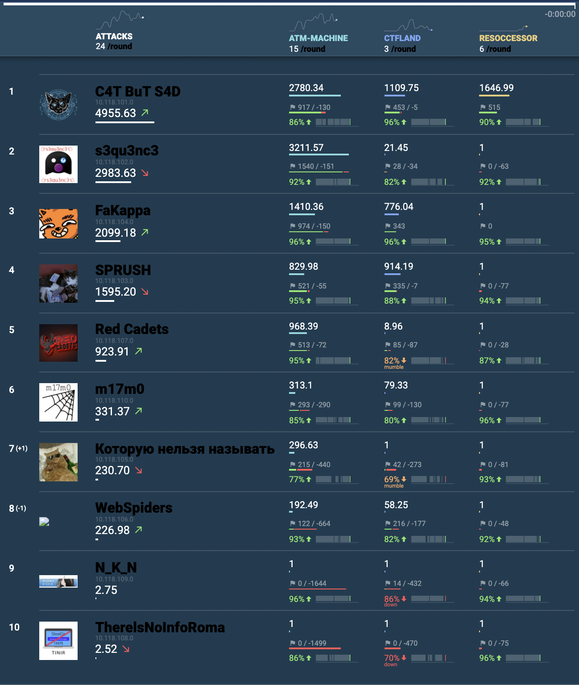

# CTF Cup 2021 (A/D part)

The contest is driven by classic rules (Attack-Defense [CTF](https://en.wikipedia.org/wiki/Capture_the_flag#Computer_security)). Each team is given a set of vulnerable services. Organizers regulary fill services with private information — the flags. The goal of each team is to find vulnerabilities, fix them in their services and exploit them in order to get flags from other teams.  
  
### Team
- Infrastucture admins: [@xelez](https://github.com/xelez) & [@vaspahomov](https://github.com/vaspahomov)
- "ATM-machine" service: [@AlexanderKargin](https://github.com/AlexanderKargin)
- "CTFLand" service: [@Leofwin](https://github.com/Leofwin)
- "resoccessor" service: [@werelaxe](https://github.com/werelaxe)
- Devteam leads: [@kot](https://github.com/kot) & [@rx00](https://github.com/rx00)
  
### Final scoreboard
  

CTF Cup 2021 (A/D part) was held on December 11, 2021.  
Copyright (C) 2021 [HackerDom](http://hackerdom.ru)
